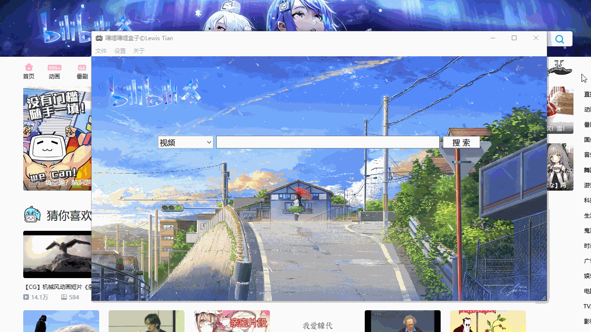

## bili-box
嗶哩嗶哩工具箱: 一个用来下载视频、图片(或许会增加下载音频的功能也不一定)的一个小东西。

> 简约但不简单

我的设计哲学如上所示，所以不会过多使用/添加 qss 样式导致应用显得花里胡哨的，基本会直接使用原生控件的样式。

注：本项目图标大部分来自 [iconfont](http://www.iconfont.cn).

### Preface
这个算是对之前做的一个 [bilibili-kit](https://github.com/LewisTian/PyQt5-Apps/blob/master/bilibili-kit) 的一个升级/整合吧(其实是我不小心把它的 Qt 文件夹删了 ;3)<br >
因为界面是用 Qt 写的，然后用 pyuic5 将 ui 文件转成 py 来使用，没了 Qt 相关的代码我就改不了界面，而且过了这么久，没有界面对着看，我都忘了那些变量对应的是哪个控件；所以这次会吸取教训将 Qt 的文件夹也上传 ;0 ，将其放到 Qt/ 路径下，而其他 Python 源代码将放在 src/ 路径下 <span></span>

### Preview
展示一下当前已经实现的功能(gif 有点大，可能预览效果不太好233)
<div align="center">
	
</div>

### Basic Features
详情查看 [Log](LOG.md)
- 下载
	- 添加下载视频功能(路径为系统下载路径的 /$avid/)
	- 添加合并功能
	- 添加下载图片功能(路径为系统下载路径的 /images/)
- 自定义
	- 修改窗口最小尺寸(默认是 960x540)
	- 修改背景图片
	- 修改下载路径
- 其他
	- 根据季节修改左上角 logo(很抱歉只收集到了嗶哩嗶哩秋和冬，若是谁有春和夏麻烦发我一下)
	- 切换功能页面

### Installation
```bash
>> git clone https://github.com/LewisTian/bili-box.git
>> cd bili-box
>> pip install -r requirements.txt
>> python3 main.py
```
若是想修改界面，则需要先装 [Qt](https://www.qt.io/)(我用的是 Qt 5.11)，安装好之后，双击 Qt/bili-box.pro 文件，然后可以根据个人审美来修改 ui 文件，之后将其转化为 py 文件，使用命令 `pyuic5.exe mwin.ui -o ../src/mwin.py`

若是想添加图标/图片资源，则可以修改 Qt/res.qrc 文件，使用命令 `pyrcc5.exe res.qrc -o ../src/res_rc.py` 将其转化为 py 文件

### KeyBindings

Key Binding                                | Description
-------------------------------------------|---------------------------------------------------------
<kbd>Enter</kbd>                           | 搜索
<kbd>Ctrl + W</kbd>                        | 退出程序
<kbd>Ctrl + H</kbd>                        | 切换到首页
<kbd>Ctrl + Q</kbd>                        | 切换到视频下载页
<kbd>Ctrl + E</kbd>                        | 切换到图片下载页
<kbd>Ctrl + F</kbd>                        | 切换到收藏页
<kbd>Ctrl + B</kbd>                        | 修改背景图片
<kbd>Ctrl + M</kbd>                        | 修改程序最小尺寸
<kbd>Ctrl + P</kbd>                        | 修改下载路径
<kbd>Shift + A</kbd>                       | 帮助/app详情
<kbd>Alt + A</kbd>                         | 关于作者/我的详情

### LICENSE
Copyright (c) 2018 Lewis Tian. Licensed under the MIT license.