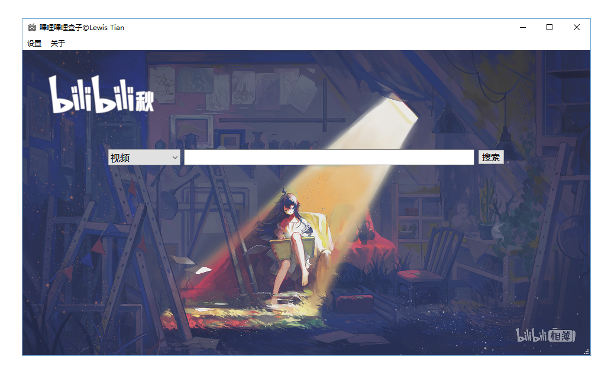

## 嗶哩嗶哩工具箱
一个用来下载视频、图片（或许会增加下载音频的功能也不一定）的一个小东西。 
注：本项目图标大部分来自 [iconfont](http://www.iconfont.cn).

	

### 前言
这个算是对之前做的一个 [bilibili-kit](https://github.com/LewisTian/PyQt5-Apps/blob/master/bilibili-kit) 的一个升级/整合吧（其实是我不小心把它的 Qt 文件夹删了 ;3） 
因为界面是用 Qt 写的，然后用 pyuic5 将 ui 文件转成 py 来使用，没了 Qt 相关的代码我就改不了界面，而且过了这么久，没有界面对着看，我都忘了那些变量对应的是哪个控件；所以这次会吸取教训将 Qt 的文件夹也上传 ;0 ，将其放到 Qt/ 路径下，而其他 Python 源代码将放在 src/ 路径下

	

### 預覽
展示一下当前已经实现的功能

	

### 功能
详情查看 [Log](LOG.md)
- 修改窗口最小尺寸(默认是 960x540)
- 根据季节修改左上角 logo(很抱歉只收集到了嗶哩嗶哩秋和冬，若是谁有春和夏麻烦发我一下)
- 修改背景图片

### LICENSE
Copyright (c) 2018 Lewis Tian. Licensed under the MIT license.